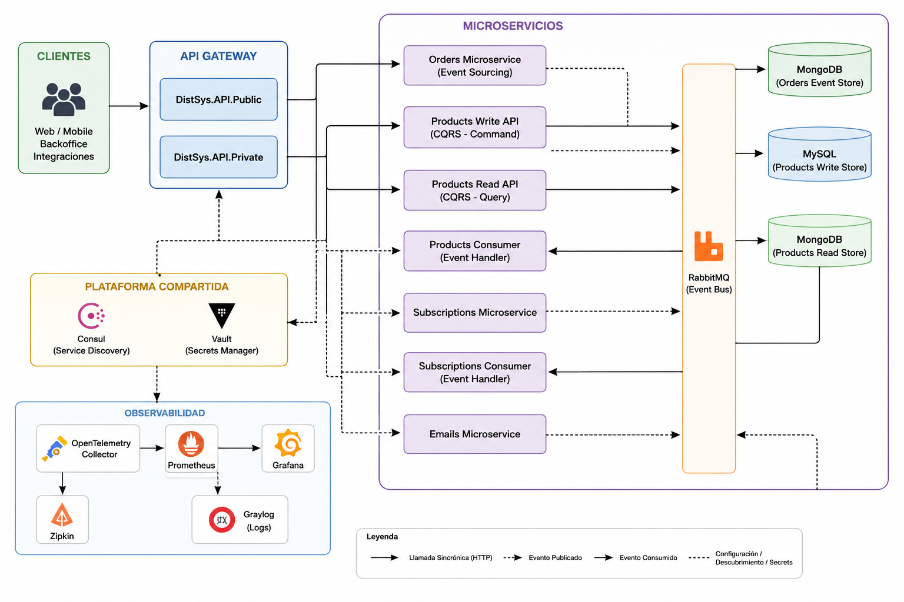

# Sistemas distribuidos

Proyecto práctico para estudiar cómo se construye una arquitectura distribuida con .NET, microservicios, API Gateway, mensajería asíncrona, descubrimiento de servicios, gestión de secretos, persistencia separada, observabilidad y health checks.

La solución combina APIs REST, Minimal APIs, YARP, RabbitMQ, Consul, Vault, MySQL, MongoDB, OpenTelemetry, Prometheus, Grafana, Zipkin y Graylog.



---

## Objetivo

El objetivo es mostrar cómo interactúan distintas piezas dentro de un sistema distribuido realista:

```text
Cliente
  ↓
API Gateway
  ↓
Microservicios HTTP
  ↓
Persistencia propia por servicio
  ↓
Eventos / mensajes asíncronos
  ↓
Consumers
  ↓
Read models / efectos secundarios
```

La solución permite estudiar:

- entrada centralizada mediante API Gateway;
- separación entre gateway público y gateway privado;
- rutas proxy con YARP;
- APIs REST con controllers;
- Minimal APIs en endpoints simples;
- validación de API Key en el gateway privado;
- rate limiting por cliente;
- publicación y consumo de mensajes con RabbitMQ;
- eventos de dominio y eventos de integración;
- consistencia eventual mediante consumers;
- CQRS en Products;
- Event Sourcing en Orders;
- service discovery con Consul;
- secretos con Vault;
- persistencia con MySQL y MongoDB;
- serialización centralizada;
- respuestas HTTP unificadas con `Result<T>`, `ResultDto<T>` y `ToActionResult()`;
- health checks;
- observabilidad con métricas, trazas y logs centralizados;
- patrón productor-consumidor como base de la mensajería;
- diseño de sagas para operaciones distribuidas de varios pasos;
- idempotencia en consumers, mensajes y endpoints sensibles a reintentos;
- consistencia entre base de datos y publicación de eventos;
- evolución posible hacia .NET Aspire para orquestación local y observabilidad integrada;
- tests unitarios y tests de integración.

---

## Arquitectura general

```text
Clientes externos
  │
  ▼
DistSys.API.Public
  ├── /order-ms/{**catch-all}   → Orders API
  ├── /product-ms/{**catch-all} → Products Write API
  └── /subscribe                → RabbitMQ / mensaje de integración

Clientes internos / administrativos
  │
  ▼
DistSys.API.Private
  ├── API Key middleware
  ├── Rate limiting
  └── /reports/{**catch-all} → Orders API

Microservicios
  ├── Orders
  │   ├── API principal
  │   ├── lógica de negocio
  │   ├── Event Sourcing
  │   ├── MongoDB
  │   └── consumers
  │
  ├── Products
  │   ├── Write API
  │   ├── Read API
  │   ├── lógica de negocio
  │   ├── MySQL como write store
  │   ├── MongoDB como read store
  │   └── consumers
  │
  ├── Subscriptions
  │   ├── API
  │   ├── DTOs
  │   └── consumer
  │
  └── Emails
      └── API

Infraestructura
  ├── RabbitMQ
  ├── Consul
  ├── Vault
  ├── MySQL
  ├── MongoDB
  ├── OpenTelemetry Collector
  ├── Prometheus
  ├── Grafana
  ├── Zipkin
  └── Graylog
```

---

## Proyectos de la solución

```text
DistSys
├── src
│   ├── Api
│   │   ├── Public
│   │   │   └── DistSys.API.Public
│   │   └── Private
│   │       └── DistSys.API.Private
│   │
│   ├── Services
│   │   ├── Emails
│   │   │   └── DistSys.Services.Emails
│   │   ├── Orders
│   │   │   ├── DistSys.Services.Orders
│   │   │   ├── DistSys.Services.Orders.BusinessLogic
│   │   │   ├── DistSys.Services.Orders.Consumer
│   │   │   └── DistSys.Services.Orders.Dto
│   │   ├── Products
│   │   │   ├── DistSys.Services.Products.Api.Write
│   │   │   ├── DistSys.Services.Products.Api.Read
│   │   │   ├── DistSys.Services.Products.BusinessLogic
│   │   │   ├── DistSys.Services.Products.Consumer
│   │   │   └── DistSys.Services.Products.Dtos
│   │   └── Subscriptions
│   │       ├── DistSys.Services.Subscriptions
│   │       ├── DistSys.Services.Subscriptions.Consumer
│   │       └── DistSys.Services.Subscriptions.Dtos
│   │
│   ├── Shared
│   │   ├── DistSys.Shared.Api
│   │   ├── DistSys.Shared.Setup
│   │   ├── DistSys.Shared.Discovery
│   │   ├── DistSys.Shared.Secrets
│   │   ├── DistSys.Shared.Logging
│   │   ├── DistSys.Shared.Serialization
│   │   ├── DistSys.Shared.EventSourcing
│   │   ├── Shared.Communication
│   │   │   ├── DistSys.Shared.Communication
│   │   │   └── DistSys.Shared.Communication.RabbitMQ
│   │   └── Shared.Databases
│   │       ├── DistSys.Shared.Databases.MySql
│   │       └── DistSys.Shared.Databases.MongoDb
│   │
│   └── Tests
│       ├── DistSys.Tests.Services.Orders.BusinessLogicTests
│       ├── DistSys.Tests.Services.Subscriptions.ApiTests
│       └── DistSys.Test.Shared.Discovery.Tests
│
├── tools
│   ├── consul
│   ├── local-development
│   ├── mongodb
│   ├── mysql
│   ├── rabbitmq
│   ├── telemetry
│   └── vault
│
├── docker-compose.yaml
└── DistSys.sln
```

---

## Tecnologías usadas

| Área | Tecnología |
|---|---|
| APIs HTTP | ASP.NET Core |
| API Gateway | YARP Reverse Proxy |
| Controllers | MVC Controllers |
| Endpoints simples | Minimal APIs |
| Mensajería | RabbitMQ |
| Service discovery | Consul |
| Secret manager | HashiCorp Vault |
| Base relacional | MySQL |
| ORM | Entity Framework Core |
| Base documental | MongoDB |
| Event sourcing | MongoDB + eventos de dominio |
| Serialización | System.Text.Json y Newtonsoft.Json |
| Observabilidad | OpenTelemetry |
| Métricas | Prometheus |
| Dashboards | Grafana |
| Trazas | Zipkin |
| Logging | Serilog |
| Logs centralizados | Graylog |
| Health checks | ASP.NET Core Health Checks |
| Tests | xUnit, Moq, WebApplicationFactory |

---

## Configuración común de APIs

La configuración base de las aplicaciones ASP.NET Core está centralizada en:

```text
src/Shared/DistSys.Shared.Setup/API/DefaultDistSysWebApplication.cs
```

Este helper crea una aplicación web con configuración común:

```text
WebApplication.CreateBuilder(args)
  ↓
Health checks
  ↓
Controllers
  ↓
Swagger
  ↓
Lowercase URLs
  ↓
Serializer
  ↓
Service discovery
  ↓
Secret manager
  ↓
Serilog
  ↓
OpenTelemetry tracing
  ↓
OpenTelemetry metrics
```

También centraliza el arranque:

```text
UseSwagger() en Development
MapHealthChecks("/health")
UseHealthChecks("/health")
UseHealthChecksUI("/health-ui")
UseHttpsRedirection()
UseAuthorization()
MapControllers()
Run()
```

Esto evita repetir la misma configuración en cada microservicio.

Endpoints técnicos comunes:

| Endpoint | Uso |
|---|---|
| `/swagger` | Documentación OpenAPI en entorno de desarrollo. |
| `/health` | Estado de salud de la aplicación y dependencias registradas. |
| `/health-ui` | Interfaz visual para health checks. |

---

## API Gateway con YARP

La solución tiene dos gateways:

| Proyecto | Responsabilidad |
|---|---|
| `DistSys.API.Public` | Entrada pública hacia servicios expuestos al cliente. |
| `DistSys.API.Private` | Entrada privada para rutas internas o administrativas. |

Ambos usan:

```csharp
Services.AddReverseProxy()
    .LoadFromConfig(Configuration.GetSection("ReverseProxy"));
```

Y al final registran:

```csharp
app.MapReverseProxy();
```

### Gateway público

Proyecto:

```text
src/Api/Public/DistSys.API.Public
```

Rutas configuradas:

| Ruta externa | Destino |
|---|---|
| `/order-ms/{**catch-all}` | `https://localhost:60220/` |
| `/product-ms/{**catch-all}` | `https://localhost:60320/` |

El gateway público también expone un endpoint propio:

```text
POST /subscribe
```

Ese endpoint recibe un `SubscriptionDto` y publica un mensaje de integración en RabbitMQ con `routingKey = "subscription"`.

Flujo:

```text
Cliente
  ↓
POST /subscribe
  ↓
DistSys.API.Public
  ↓
IIntegrationMessagePublisher
  ↓
RabbitMQ
  ↓
subscription.exchange
  ↓
subscription-queue
```

### Gateway privado

Proyecto:

```text
src/Api/Private/DistSys.API.Private
```

Rutas configuradas:

| Ruta externa | Destino |
|---|---|
| `/reports/{**catch-all}` | `https://localhost:60220/` |

Además, el gateway privado aplica:

```text
API Key middleware
Rate limiting
```

---

## API Key en el gateway privado

La validación de API Key está en:

```text
src/Shared/DistSys.Shared.Setup/API/Key
```

Archivos principales:

| Archivo | Responsabilidad |
|---|---|
| `ApiKeyConfiguration.cs` | Modelo de configuración para la API Key. |
| `ApiKeyDependencyInjection.cs` | Registra configuración y middleware. |
| `ApiKeyMiddleware.cs` | Valida el header entrante. |

El gateway privado registra la configuración con:

```csharp
webappBuilder.Services.AddApiToken(webappBuilder.Configuration);
```

Y activa el middleware con:

```csharp
app.UseApiTokenMiddleware();
```

La configuración está en:

```json
"ApiKey": {
  "clientId": "1",
  "value": "b92b0bdf-da95-42a8-a2b1-780ca461aaf3"
}
```

El cliente debe enviar el header:

```http
apiKey: b92b0bdf-da95-42a8-a2b1-780ca461aaf3
```

El middleware revisa si existe el header `apiKey` y compara su valor contra `ApiKey:value`.

Flujo:

```text
Request HTTP
  ↓
ApiKeyMiddleware
  ↓
¿Existe header apiKey?
  ├── No → UnauthorizedAccessException
  └── Sí
      ↓
      ¿Coincide con ApiKey:value?
        ├── No → UnauthorizedAccessException
        └── Sí → continúa el pipeline
```

La validación no se aplica a rutas de salud, porque `UseApiTokenMiddleware()` usa `UseWhen` para excluir rutas que empiezan por:

```text
/health
```

Eso permite consultar:

```text
/health
/health-ui
```

sin enviar API Key.

---

## Rate limiting

El rate limiting está definido en:

```text
src/Shared/DistSys.Shared.Setup/API/RateLimiting/DistSysRateLimiterPolicy.cs
```

El gateway privado lo activa con:

```csharp
app.UseRateLimiter();
```

Y lo aplica sobre el endpoint:

```text
GET /rate-limiting-test
```

La política usa ventana fija:

| Parámetro | Valor |
|---|---|
| Tipo | Fixed window |
| Límite | 2 requests |
| Ventana | 60 minutos |
| Partición | Valor del header `apiKey` |
| Respuesta al superar límite | `429 Too Many Requests` |

Flujo:

```text
Request
  ↓
Lee header apiKey
  ↓
Usa apiKey como partition key
  ↓
Permite hasta 2 requests por 60 minutos
  ↓
Si supera el límite → 429 Too Many Requests
```

Respuesta configurada al superar el límite:

```text
Lots of calls, please try later
```

---

## Controllers y Minimal APIs

La solución usa ambos estilos de ASP.NET Core.

### Controllers

Se usan en endpoints con más estructura o lógica propia de API REST:

| Proyecto | Controller |
|---|---|
| Orders API | `OrderController` |
| Products Write API | `ProductController` |
| Subscriptions API | `SubscriptionController` |
| Emails API | `EmailController` |

Ejemplo:

```csharp
[ApiController]
[Route("[controller]")]
public class OrderController
{
    [HttpGet("{orderId}")]
    public async Task<IActionResult> GetOrder(Guid orderId) => ...;
}
```

### Minimal APIs

Se usan para endpoints pequeños o para configuración directa del gateway:

| Proyecto | Endpoint |
|---|---|
| `DistSys.API.Public` | `GET /` |
| `DistSys.API.Public` | `POST /subscribe` |
| `DistSys.API.Private` | `GET /` |
| `DistSys.API.Private` | `GET /rate-limiting-test` |
| `DistSys.Services.Products.Api.Read` | `GET product/{productId}` |

Ejemplo:

```csharp
app.MapGet(
    "product/{productId}",
    async (int productId, IProductsReadStore readStore) => await readStore.GetFullProduct(productId)
);
```

La diferencia práctica es:

| Estilo | Uso preferente |
|---|---|
| Controller | Endpoints con varias acciones, atributos, documentación por action y lógica REST más explícita. |
| Minimal API | Endpoints simples, gateways, pruebas rápidas o servicios pequeños. |

---

## Buenas prácticas para URLs de APIs REST

Una API REST debería diseñar URLs alrededor de recursos, no alrededor de acciones imperativas.

Reglas generales:

| Regla | Ejemplo recomendado |
|---|---|
| Usar sustantivos | `/orders` |
| Usar plural para colecciones | `/products` |
| Usar identificadores en la ruta | `/orders/{orderId}` |
| Usar el verbo HTTP para expresar la operación | `GET`, `POST`, `PUT`, `PATCH`, `DELETE` |
| Evitar verbos en la URL cuando el verbo HTTP ya expresa la acción | mejor `/orders/{id}/payment` que `/order/markaspaid` |
| Mantener consistencia entre servicios | mismo patrón para Orders, Products, Subscriptions |

### Ejemplos por verbo HTTP

| Operación | Método | URL recomendada | Significado |
|---|---:|---|---|
| Obtener pedido | `GET` | `/orders/{orderId}` | Devuelve un pedido por id. |
| Crear pedido | `POST` | `/orders` | Crea un nuevo pedido. |
| Marcar pedido como pagado | `PUT` | `/orders/{orderId}/payment` | Crea o reemplaza el estado de pago del pedido. |
| Marcar pedido como despachado | `PUT` | `/orders/{orderId}/dispatch` | Registra el despacho del pedido. |
| Marcar pedido como entregado | `PUT` | `/orders/{orderId}/delivery` | Registra la entrega del pedido. |
| Crear producto | `POST` | `/products` | Crea un nuevo producto. |
| Actualizar producto completo | `PUT` | `/products/{productId}` | Reemplaza o actualiza el recurso producto. |
| Actualizar parcialmente un producto | `PATCH` | `/products/{productId}` | Modifica una parte del producto. |
| Eliminar producto | `DELETE` | `/products/{productId}` | Elimina un producto. |
| Crear suscripción | `POST` | `/subscriptions` | Registra una suscripción. |
| Cancelar suscripción | `DELETE` | `/subscriptions/{subscriptionId}` | Elimina o cancela una suscripción. |

### Endpoints actuales y alternativa REST más consistente

| Endpoint actual | Alternativa más consistente |
|---|---|
| `GET /order/{orderId}` | `GET /orders/{orderId}` |
| `POST /order/create` | `POST /orders` |
| `PUT /order/markaspaid?orderId={id}` | `PUT /orders/{id}/payment` |
| `PUT /order/markasdispatched?orderId={id}` | `PUT /orders/{id}/dispatch` |
| `PUT /order/markasdelivered?orderId={id}` | `PUT /orders/{id}/delivery` |
| `POST /product` | `POST /products` |
| `PUT /product/updateproductdetails/{id}` | `PUT /products/{id}` |
| `GET /product/{productId}` | `GET /products/{productId}` |
| `POST /subscription` | `POST /subscriptions` |
| `DELETE /subscription` | `DELETE /subscriptions/{subscriptionId}` |

La solución actual funciona, pero esta tabla muestra cómo evolucionar las rutas hacia un estilo REST más uniforme.

---

## CORS en esta arquitectura

CORS es relevante cuando un frontend ejecutado en navegador llama a una API desde un origen distinto.

Un origen se compone de:

```text
protocolo + dominio + puerto
```

Ejemplos de orígenes distintos:

```text
http://localhost:5173
https://localhost:5001
https://api.midominio.com
https://app.midominio.com
```

Aunque dos aplicaciones estén en la misma máquina, si cambian el protocolo, dominio o puerto, para el navegador son orígenes distintos.

CORS afecta a llamadas desde navegador. No afecta igual a:

```text
Postman
curl
workers
consumers
llamadas backend/backend con HttpClient
```

### Preflight

El navegador puede enviar una request previa `OPTIONS`, llamada preflight, antes de enviar la request real.

Casos habituales que generan preflight:

| Caso | Ejemplo |
|---|---|
| Método no simple | `PUT`, `DELETE`, `PATCH` |
| Header custom | `apiKey`, `Authorization`, `token` |
| Content-Type no simple | `application/json` |
| Credenciales | cookies o headers de autenticación |

En una arquitectura con gateway, la política CORS debería definirse preferentemente en el borde público, es decir, en el gateway que recibe llamadas desde el navegador.

Ejemplo conceptual:

```csharp
builder.Services.AddCors(options =>
{
    options.AddPolicy("Frontend", policy =>
    {
        policy
            .WithOrigins("http://localhost:5173")
            .AllowAnyHeader()
            .AllowAnyMethod();
    });
});

app.UseCors("Frontend");
```

Si se usa `apiKey` como header desde navegador, hay que permitir ese header en la política CORS.

---

## Respuestas HTTP con Result y ToActionResult

La solución usa un patrón de resultados para separar la lógica de negocio de la respuesta HTTP final.

En vez de que todos los controllers construyan manualmente respuestas con `Ok(...)`, `Created(...)` o `NotFound(...)`, varios endpoints devuelven resultados usando:

```text
Result<T>
ResultDto<T>
Success()
UseSuccessHttpStatusCode(...)
ToActionResult()
```

Ejemplo en Orders:

```csharp
return await _createOrderService
    .Execute(createOrderRequest, cancellationToken)
    .UseSuccessHttpStatusCode(HttpStatusCode.Created)
    .ToActionResult();
```

Ejemplo en Products:

```csharp
return result
    .Success()
    .UseSuccessHttpStatusCode(HttpStatusCode.Created)
    .ToActionResult();
```

Flujo conceptual:

```text
Controller
  ↓
Servicio de aplicación / caso de uso
  ↓
Result<T>
  ↓
UseSuccessHttpStatusCode(...)
  ↓
ToActionResult()
  ↓
Respuesta HTTP uniforme
```

Esto permite que la lógica de negocio exprese éxito o error sin depender directamente de MVC.

---


## Patrón productor-consumidor como base

Antes de mirar RabbitMQ como tecnología concreta, la solución se entiende mejor como una aplicación del patrón productor-consumidor.

```text
Productor
  ↓
Publica un mensaje
  ↓
Broker / cola
  ↓
Consumidor
  ↓
Ejecuta trabajo fuera del flujo HTTP original
```

En esta arquitectura, el productor no necesita conocer directamente al consumidor. Publica un mensaje con un contrato conocido y continúa su flujo. El consumidor procesa ese mensaje cuando le corresponde.

Ejemplos dentro de la solución:

| Productor | Mensaje / evento | Consumidor | Resultado |
|---|---|---|---|
| `DistSys.API.Public` | Suscripción | `Subscriptions.Consumer` | Procesamiento asíncrono de la suscripción. |
| `Products Write API` | Evento de producto | `Products.Consumer` | Actualización del read model en MongoDB. |
| `Orders API` | Evento de pedido | `Orders.Consumer` | Procesamiento de eventos relacionados con pedidos. |

Este patrón permite desacoplar servicios, absorber picos de carga y evitar que una operación HTTP tenga que esperar a que todos los efectos secundarios terminen.

Conceptualmente:

```text
Request HTTP rápida
  ↓
Persistencia del cambio principal
  ↓
Publicación de evento
  ↓
Consumers actualizan modelos derivados o ejecutan efectos secundarios
```

La consecuencia natural es que algunas vistas o efectos secundarios no son inmediatos. El sistema acepta consistencia eventual a cambio de menor acoplamiento y mejor tolerancia a fallos.

---

## Mensajería con RabbitMQ

RabbitMQ se usa para desacoplar servicios mediante mensajes.

La solución distingue dos tipos de mensajes:

| Tipo | Uso |
|---|---|
| `DomainMessage<T>` | Evento interno de un dominio. |
| `IntegrationMessage<T>` | Evento de integración entre servicios. |

Los mensajes implementan un contrato común:

```text
IMessage
```

Y llevan metadata:

```text
Metadata
```

La metadata permite adjuntar información transversal del mensaje, como identificador, fecha, tipo o datos necesarios para trazabilidad.

### Exchanges y colas principales

La configuración local de RabbitMQ está en:

```text
tools/rabbitmq/definitions.json
```

Exchanges principales:

| Exchange | Uso |
|---|---|
| `api.public.exchange` | Entrada de mensajes publicados desde el gateway público. |
| `subscription.exchange` | Mensajes de suscripciones. |
| `order.exchange` | Eventos relacionados con Orders. |
| `products.exchange` | Eventos relacionados con Products. |
| `dead-letter.exchange` | Mensajes enviados a dead letter. |

Colas principales:

| Cola | Uso |
|---|---|
| `subscription-queue` | Consumo de suscripciones. |
| `order-domain-queue` | Eventos de dominio de Orders. |
| `order-queue` | Eventos externos hacia Orders. |
| `product-domain-queue` | Eventos internos de Products. |
| `product-queue` | Eventos externos hacia Products. |

También existen colas `.dead-letter` para mensajes que no pueden procesarse correctamente.

---

## Publishers

La publicación está abstraída en:

```text
src/Shared/Shared.Communication/DistSys.Shared.Communication/Publisher
```

Componentes principales:

| Componente | Responsabilidad |
|---|---|
| `IDomainMessagePublisher` | Publica eventos de dominio. |
| `IIntegrationMessagePublisher` | Publica eventos de integración. |
| `DefaultDomainMessagePublisher` | Construye y publica `DomainMessage<T>`. |
| `DefaultIntegrationMessagePublisher` | Construye y publica `IntegrationMessage<T>`. |
| `RabbitMQMessagePublisher<TMessage>` | Implementación concreta contra RabbitMQ. |

Flujo:

```text
Caso de uso
  ↓
IDomainMessagePublisher / IIntegrationMessagePublisher
  ↓
Mapper de mensaje
  ↓
RabbitMQMessagePublisher
  ↓
Exchange RabbitMQ
```

Ejemplos:

| Lugar | Tipo de publicación |
|---|---|
| Orders API | Publica eventos de dominio de pedidos. |
| Products Write API | Publica eventos de dominio de productos. |
| Products Consumer | Publica eventos de integración. |
| Subscriptions API | Publica eventos de integración. |
| API Gateway público `/subscribe` | Publica evento de integración. |

---

## Consumers, handlers y ciclo de vida

La parte de consumo está en:

```text
src/Shared/Shared.Communication/DistSys.Shared.Communication/Consumer
```

Componentes principales:

| Componente | Responsabilidad |
|---|---|
| `IMessageConsumer<T>` | Abstracción de consumidor. |
| `RabbitMQMessageConsumer<T>` | Implementación de consumidor RabbitMQ. |
| `RabbitMQMessageReceiver` | Recibe mensajes desde RabbitMQ y los deserializa. |
| `IConsumerManager<T>` | Coordina el consumo. |
| `ConsumerManager<T>` | Implementación del manager. |
| `ConsumerHostedService<T>` | Arranca el consumo como hosted service. |
| `ConsumerController<T>` | Permite controlar el consumer por HTTP. |
| `IMessageHandler<T>` | Contrato de handlers. |
| `MessageHandlerRegistry` | Registro de handlers disponibles. |
| `HandleMessage` | Ejecuta el handler correspondiente. |

Flujo:

```text
RabbitMQ queue
  ↓
RabbitMQMessageConsumer<T>
  ↓
RabbitMQMessageReceiver
  ↓
ISerializer
  ↓
HandleMessage
  ↓
MessageHandlerRegistry
  ↓
IMessageHandler<T>
  ↓
Lógica del consumer
```

Los consumers se registran en proyectos separados:

| Proyecto | Responsabilidad |
|---|---|
| `DistSys.Services.Orders.Consumer` | Consume eventos de Orders y eventos de integración de Products. |
| `DistSys.Services.Products.Consumer` | Consume eventos de dominio de Products y actualiza read store. |
| `DistSys.Services.Subscriptions.Consumer` | Consume mensajes de suscripción. |

---


## Idempotencia en mensajes y APIs

En un sistema distribuido, una operación puede ejecutarse más de una vez por reintentos, timeouts, reconexiones o redelivery del broker. Por eso las operaciones importantes deberían diseñarse para ser idempotentes.

Una operación idempotente puede repetirse sin producir efectos duplicados no deseados.

Ejemplo conceptual:

```text
Procesar ProductUpdated con MessageIdentifier = abc-123
  ↓
Si no fue procesado antes → aplicar cambio y registrar mensaje
  ↓
Si ya fue procesado antes → ignorar o devolver resultado existente
```

En esta solución, la idempotencia es especialmente relevante en:

| Zona | Riesgo | Estrategia esperada |
|---|---|---|
| Consumers RabbitMQ | El broker puede reenviar un mensaje. | Usar identificador de mensaje y evitar procesarlo dos veces. |
| Actualización de read models | El mismo evento puede llegar repetido. | Aplicar upsert o verificar versión/identificador. |
| Cambios de estado de Orders | Un pedido puede recibir dos veces el mismo comando. | Validar estado actual antes de aplicar el cambio. |
| Endpoints HTTP con `PUT` | El cliente puede reintentar la request. | Hacer que repetir el mismo cambio deje el recurso en el mismo estado final. |

En la solución ya existe metadata asociada a los mensajes. Esa metadata es el lugar natural para transportar identificadores útiles para trazabilidad e idempotencia.

Flujo recomendado para consumers:

```text
Mensaje recibido
  ↓
Leer MessageIdentifier / metadata
  ↓
Comprobar si ya fue procesado
  ↓
Si no existe, ejecutar handler
  ↓
Persistir efecto y marca de procesado
  ↓
Confirmar mensaje
```

La idempotencia no es un detalle menor. Es una condición práctica para que los reintentos sean seguros.

---

## Registro automático de handlers

Los handlers se registran con:

```csharp
builder.Services.AddHandlersInAssembly<THandler>();
```

Este método usa escaneo de assembly para encontrar clases que implementan contratos de handler.

Ejemplos:

```csharp
builder.Services.AddHandlersInAssembly<OrderCreatedHandler>();
builder.Services.AddHandlersInAssembly<ProductUpdatedHandler>();
builder.Services.AddHandlersInAssembly<SubscriptionHandler>();
```

Esto evita registrar cada handler manualmente.

Flujo:

```text
AddHandlersInAssembly<T>()
  ↓
Escanea el assembly de T
  ↓
Encuentra handlers
  ↓
Los registra en DI
  ↓
Los agrega a MessageHandlerRegistry
```

---

## Service discovery con Consul

Consul se usa para resolver direcciones de servicios en tiempo de ejecución.

Proyecto:

```text
src/Shared/DistSys.Shared.Discovery
```

Componentes:

| Componente | Responsabilidad |
|---|---|
| `IServiceDiscovery` | Contrato de resolución de servicios. |
| `ConsulServiceDiscovery` | Implementación usando Consul. |
| `DiscoveryServices` | Nombres constantes de servicios. |
| `DiscoveryDependencyInjection` | Registro en DI. |

El script local registra servicios e infraestructura:

```text
tools/consul/config.sh
```

Servicios registrados:

| Nombre en Consul | Puerto |
|---|---:|
| `RabbitMQ` | `5672` |
| `SecretManager` | `8200` |
| `MySql` | `3307` |
| `MongoDb` | `27017` |
| `Graylog` | `12201` |
| `OpenTelemetryCollector` | `4317` |
| `EmailsApi` | `60120` |
| `ProductsApiWrite` | `60320` |
| `ProductsApiRead` | `60321` |
| `OrdersApi` | `60220` |
| `SubscriptionsApi` | `60420` |

Flujo:

```text
Servicio necesita dependencia externa
  ↓
IServiceDiscovery.GetFullAddress(...)
  ↓
Consul Catalog
  ↓
host:puerto
  ↓
Cliente construye conexión final
```

El test `ConsulServiceDiscoveryTest` valida que:

- si Consul no devuelve servicios, se lanza error;
- si hay host y puerto, se construye `host:port`;
- si no hay puerto, se usa solo host;
- la resolución usa cache interna para evitar consultar Consul repetidamente.

---

## Gestión de secretos con Vault

Vault se usa para obtener credenciales en tiempo de ejecución.

Proyecto:

```text
src/Shared/DistSys.Shared.Secrets
```

Componentes:

| Componente | Responsabilidad |
|---|---|
| `ISecretManager` | Contrato para obtener secretos. |
| `VaultSecretManager` | Implementación con Vault. |
| `VaultSettings` | Configuración de Vault. |
| `VaultDependencyInjection` | Registro en DI. |

El script local configura secretos:

```text
tools/vault/config.sh
```

Secretos usados:

| Secreto | Uso |
|---|---|
| `secret/rabbitmq` | Credenciales de RabbitMQ. |
| `secret/mongodb` | Credenciales de MongoDB. |
| `secret/mysql` | Credenciales de MySQL. |

Flujo:

```text
Servicio necesita credenciales
  ↓
ISecretManager
  ↓
Vault
  ↓
Credenciales
  ↓
Construcción de connection string o cliente externo
```

---

## Persistencia

La solución usa persistencia separada según el caso de uso.

### MySQL

MySQL se usa como write store relacional para Products.

Archivos principales:

```text
src/Shared/Shared.Databases/DistSys.Shared.Databases.MySql
src/Services/Products/DistSys.Services.Products.BusinessLogic/DataAccess/ProductsWriteStore.cs
tools/mysql/init.sql
```

El script `tools/mysql/init.sql` crea la tabla:

```text
Products
```

con columnas:

```text
Id
Name
Description
```

La conexión se construye usando:

```text
Consul → host y puerto de MySQL
Vault  → usuario y password
Config → nombre de base de datos
```

### MongoDB

MongoDB se usa como read store y como almacenamiento de eventos.

Archivos principales:

```text
src/Shared/Shared.Databases/DistSys.Shared.Databases.MongoDb
src/Shared/DistSys.Shared.EventSourcing
src/Services/Products/DistSys.Services.Products.BusinessLogic/DataAccess/ProductsReadStore.cs
src/Services/Orders/DistSys.Services.Orders/Data/OrderRepository.cs
tools/mongodb/mongo-init.js
```

Colecciones iniciales:

| Colección | Uso |
|---|---|
| `Products` | Read model inicial de productos. |
| `EventsOrders` | Eventos de Orders. |
| `ProductName` | Cache/read model local de nombres de producto para Orders. |

---


## Consistencia entre base de datos y publicación de eventos

Una operación típica en esta solución sigue este patrón:

```text
Guardar cambio en base de datos
  ↓
Publicar evento en RabbitMQ
```

Ese flujo es habitual, pero tiene un problema clásico: la escritura en base de datos y la publicación en el broker son dos operaciones distintas. Una puede completarse y la otra fallar.

Ejemplo:

```text
Products Write API
  ↓
Guarda producto en MySQL
  ↓
Falla la publicación del evento ProductCreated
  ↓
El read model de MongoDB no se actualiza
```

El diseño natural para reforzar este punto es el patrón Outbox.

```text
Transacción local
  ├── Guardar cambio principal
  └── Guardar evento pendiente en tabla Outbox
        ↓
Proceso publicador
        ↓
Publica evento en RabbitMQ
        ↓
Marca evento como publicado
```

Con Outbox, el cambio de negocio y el evento pendiente quedan guardados en la misma base de datos y dentro de la misma transacción local. Después, un proceso separado publica los eventos pendientes.

Dónde encaja en esta solución:

| Servicio | Cambio principal | Evento que debería publicarse de forma consistente |
|---|---|---|
| Products Write API | Crear/actualizar producto en MySQL. | Evento de dominio de producto. |
| Orders API | Persistir evento de pedido en MongoDB. | Evento relacionado con el cambio de estado del pedido. |
| Subscriptions API | Registrar o aceptar suscripción. | Evento de integración de suscripción. |

La idempotencia y Outbox se complementan:

```text
Outbox asegura que el evento salga
Idempotencia asegura que repetirlo no duplique efectos
```

Este punto es central en sistemas distribuidos porque RabbitMQ, MySQL y MongoDB no comparten una única transacción global.

---

## Products: CQRS y read model

Products separa escritura y lectura:

| Proyecto | Responsabilidad |
|---|---|
| `DistSys.Services.Products.Api.Write` | Crear y actualizar productos. |
| `DistSys.Services.Products.Api.Read` | Leer productos desde read store. |
| `DistSys.Services.Products.BusinessLogic` | Casos de uso y acceso a datos. |
| `DistSys.Services.Products.Consumer` | Consumir eventos y actualizar read model. |

Flujo de creación o actualización:

```text
Products Write API
  ↓
Caso de uso
  ↓
MySQL
  ↓
Evento de dominio
  ↓
RabbitMQ
  ↓
Products Consumer
  ↓
MongoDB read store
```

Esto muestra CQRS:

```text
Write side → MySQL
Read side  → MongoDB
```

---

## Orders: Event Sourcing y eventos de dominio

Orders usa Event Sourcing para reconstruir el estado del agregado desde eventos.

Archivos principales:

```text
src/Services/Orders/DistSys.Services.Orders/Aggregates
src/Services/Orders/DistSys.Services.Orders/Events
src/Services/Orders/DistSys.Services.Orders/Data/OrderRepository.cs
src/Shared/DistSys.Shared.EventSourcing
```

Eventos de Orders:

| Evento | Significado |
|---|---|
| `OrderCreated` | Pedido creado. |
| `OrderPaid` | Pedido pagado. |
| `OrderDispatched` | Pedido despachado. |
| `OrderDelivered` | Pedido entregado. |

Flujo:

```text
Request HTTP
  ↓
OrderController
  ↓
Servicio de dominio
  ↓
OrderDetails
  ↓
AggregateChange
  ↓
EventStore
  ↓
MongoDB
```

El agregado se reconstruye aplicando eventos anteriores:

```text
Eventos persistidos
  ↓
AggregateRepository
  ↓
Apply(...)
  ↓
Estado actual del pedido
```

---

## Cache de nombres de productos en Orders

Orders necesita mostrar nombres de productos, pero el dueño natural de esos datos es Products.

Para evitar depender siempre de una llamada HTTP al servicio Products, Orders usa `ProductNameService`.

Archivo:

```text
src/Services/Orders/DistSys.Services.Orders.BusinessLogic/Services/External/ProductNameService.cs
```

Flujo de lectura:

```text
Orders necesita ProductName
  ↓
Busca en cache distribuida
  ↓
Si no está, busca en MongoDB local
  ↓
Si no está, resuelve ProductsApiRead con Consul
  ↓
Llama a Products Read API con HttpClient
  ↓
Guarda el nombre en MongoDB/cache
  ↓
Devuelve el nombre
```

Este patrón reduce acoplamiento operativo entre microservicios y mejora resiliencia frente a llamadas repetidas.

Los tests de `ProductNameService` validan:

- lectura desde cache;
- lectura desde base local cuando no hay cache;
- llamada a otro microservicio cuando no hay dato local;
- escritura en cache y base local.

---


## Sagas y transacciones distribuidas

Una saga coordina una operación de negocio que atraviesa varios servicios y que no puede resolverse con una única transacción de base de datos.

En una arquitectura distribuida, cada servicio mantiene su propia persistencia. Por eso no conviene diseñar un flujo que dependa de una transacción global entre MySQL, MongoDB, RabbitMQ y varios microservicios.

Ejemplo conceptual aplicado a pedidos:

```text
Crear pedido
  ↓
Reservar stock
  ↓
Confirmar pago
  ↓
Enviar email
  ↓
Marcar pedido como aceptado
```

Si un paso falla, la saga no hace rollback global. Ejecuta acciones compensatorias.

```text
Pago fallido
  ↓
Liberar stock reservado
  ↓
Marcar pedido como rechazado
  ↓
Publicar evento de fallo
```

En esta solución, una saga encajaría de forma natural alrededor de Orders:

| Paso | Servicio implicado | Acción |
|---|---|---|
| 1 | Orders | Crear pedido. |
| 2 | Products / Warehouse conceptual | Reservar o validar stock. |
| 3 | Payments conceptual | Confirmar pago. |
| 4 | Emails | Enviar notificación. |
| 5 | Orders | Cambiar estado del pedido. |

El agregado `Order` ya modela cambios de estado mediante eventos como `OrderCreated`, `OrderPaid`, `OrderDispatched` y `OrderDelivered`. Eso facilita representar una saga como una secuencia explícita de estados y eventos.

Diseño recomendado:

```text
Saga coordinator / process manager
  ↓
Escucha eventos de dominio
  ↓
Decide siguiente comando
  ↓
Publica comando o mensaje de integración
  ↓
Escucha resultado
  ↓
Continúa o compensa
```

La saga no reemplaza RabbitMQ, Event Sourcing ni CQRS. Los usa para coordinar procesos largos con consistencia eventual.

---

## Subscriptions

Subscriptions expone endpoints para crear o cancelar suscripciones.

Proyecto principal:

```text
src/Services/Subscriptions/DistSys.Services.Subscriptions
```

Controller:

```text
SubscriptionController
```

Endpoints actuales:

| Método | Ruta | Uso |
|---|---|---|
| `POST` | `/subscription` | Publica una suscripción. |
| `DELETE` | `/subscription` | Cancela una suscripción. |

El alta de suscripción publica un mensaje de integración:

```text
SubscriptionController
  ↓
IIntegrationMessagePublisher
  ↓
RabbitMQ
  ↓
Subscriptions Consumer
```

El gateway público también puede publicar una suscripción desde:

```text
POST /subscribe
```

---

## Emails

Emails expone un endpoint de envío:

```text
POST /email
```

Archivo:

```text
src/Services/Emails/DistSys.Services.Emails/Controllers/EmailController.cs
```

DTO usado:

```csharp
public record EmailDto(string from, string to, string subject, string body);
```

Este servicio representa el punto de integración para el envío de correos dentro del sistema.

---

## Serialización

La serialización está centralizada en:

```text
src/Shared/DistSys.Shared.Serialization
```

Componentes:

| Componente | Responsabilidad |
|---|---|
| `ISerializer` | Contrato de serialización. |
| `Serializer` | Implementación concreta. |
| `SerializationDependencyInjection` | Registro en DI. |

El serializer usa:

```text
System.Text.Json
Newtonsoft.Json
```

`Newtonsoft.Json` se usa con:

```text
TypeNameHandling.Auto
```

Esto es relevante para mensajes, eventos y objetos donde se necesita conservar información de tipo durante la serialización/deserialización.

---

## Observabilidad

La solución configura observabilidad desde:

```text
src/Shared/DistSys.Shared.Setup/Observability/OpenTelemetry.cs
src/Shared/DistSys.Shared.Logging
```

Herramientas:

| Herramienta | Uso |
|---|---|
| OpenTelemetry | Instrumentación de métricas y trazas. |
| OpenTelemetry Collector | Recepción y exportación de telemetría. |
| Prometheus | Métricas. |
| Grafana | Dashboards. |
| Zipkin | Trazas distribuidas. |
| Serilog | Logging estructurado. |
| Graylog | Centralización de logs. |

Puertos relevantes:

| Servicio | Puerto |
|---|---:|
| Prometheus | `9090` |
| Grafana | `3000` |
| Zipkin | `9411` |
| Graylog | `9000` |
| OpenTelemetry Collector OTLP | `4317` |
| RabbitMQ Management | `15672` |
| Consul UI/API | `8500` |
| Vault | `8200` |

---

## Health checks

Todas las aplicaciones creadas con `DefaultDistSysWebApplication` exponen:

```text
/health
/health-ui
```

Además, algunas dependencias registran checks específicos:

| Dependencia | Check |
|---|---|
| MySQL | `AddMySql(...)` |
| MongoDB | `AddMongoDb(...)` |
| RabbitMQ | `AddRabbitMQ(...)` |
| Products desde Orders | `ProductsHealthCheck` |

`ProductsHealthCheck` valida desde Orders que Products Read API esté disponible. Para ello usa:

```text
IServiceDiscovery
IHttpClientFactory
```

Flujo:

```text
Orders Health Check
  ↓
Consul resuelve ProductsApiRead
  ↓
HttpClient llama al servicio
  ↓
Devuelve Healthy o Degraded
```

---

## Tests

La solución incluye proyectos de test para validar piezas concretas.

| Proyecto | Qué valida |
|---|---|
| `DistSys.Tests.Services.Orders.BusinessLogicTests` | Comportamiento de `ProductNameService`: cache, repositorio local, service discovery y llamada HTTP fake. |
| `DistSys.Tests.Services.Subscriptions.ApiTests` | Test de API con `WebApplicationFactory` y publisher fake. |
| `DistSys.Test.Shared.Discovery.Tests` | Resolución de servicios con Consul y uso de cache interna. |

### Test de API con WebApplicationFactory

El test de Subscriptions usa:

```csharp
WebApplicationFactory<Program>
```

y crea un cliente con:

```csharp
HttpClient client = subscriptionApi.CreateClient();
```

Ese `HttpClient` no es un cliente externo tradicional: es un cliente conectado al servidor de prueba levantado en memoria por ASP.NET Core.

Por eso se puede llamar a la API usando rutas relativas:

```text
/subscription
```

Flujo:

```text
Test
  ↓
WebApplicationFactory
  ↓
API levantada en memoria
  ↓
HttpClient de prueba
  ↓
Endpoint real
  ↓
Dependencias reemplazadas por fake/mock
```

---

## Infraestructura local

La infraestructura local se levanta con Docker Compose.

Script recomendado:

```bash
./tools/local-development/up.sh
```

Ese script ejecuta:

```text
docker-compose up -d
configuración de Vault
registro de servicios en Consul
```

Servicios principales:

| Servicio | Puerto |
|---|---:|
| RabbitMQ | `5672` |
| RabbitMQ Management | `15672` |
| Consul | `8500` |
| Vault | `8200` |
| MySQL | `3307` |
| MongoDB | `27017` |
| Graylog | `9000` |
| Prometheus | `9090` |
| Grafana | `3000` |
| Zipkin | `9411` |

---


## Evolución posible con .NET Aspire

La solución actual levanta infraestructura local con Docker Compose y scripts en:

```text
tools/local-development/up.sh
```

Ese enfoque es válido para estudiar la infraestructura explícitamente: se ve RabbitMQ, Consul, Vault, MySQL, MongoDB, Prometheus, Grafana, Zipkin y Graylog como piezas separadas.

Una evolución natural en .NET moderno sería agregar un proyecto AppHost con .NET Aspire para centralizar la orquestación local.

Comparación conceptual:

| Enfoque actual | Con .NET Aspire |
|---|---|
| `docker-compose.yaml` y scripts manuales. | AppHost declarativo en C#. |
| Servicios levantados por separado. | Recursos y proyectos coordinados desde un host local. |
| Observabilidad repartida entre varias herramientas. | Dashboard local integrado. |
| Dependencias configuradas manualmente. | Referencias entre recursos y servicios desde código. |
| Service discovery explícito con Consul. | Service discovery integrado para escenarios locales. |

Aspire encajaría especialmente para:

- levantar todos los servicios desde un único punto;
- declarar RabbitMQ, bases de datos y APIs como recursos;
- visualizar trazas, logs y métricas en desarrollo;
- simplificar onboarding local;
- reducir comandos manuales para ejecutar la solución completa.

No sustituye los conceptos principales del proyecto. API Gateway, mensajería, CQRS, Event Sourcing, idempotencia y consistencia eventual siguen siendo los mismos. Aspire solo puede simplificar la experiencia local de ejecución y observabilidad.

---

## Orden recomendado para ejecutar en local

```text
1. Levantar infraestructura con tools/local-development/up.sh.
2. Verificar Consul, Vault, RabbitMQ, MySQL y MongoDB.
3. Levantar los microservicios base: Products Write, Products Read, Orders, Subscriptions, Emails.
4. Levantar consumers: Products Consumer, Orders Consumer, Subscriptions Consumer.
5. Levantar gateways: Public y Private.
6. Probar endpoints desde Swagger, HTTP files, curl o Postman.
7. Revisar health checks, logs, métricas y trazas.
```

---

## Endpoints principales

### Gateway público

| Método | Ruta | Uso |
|---|---|---|
| `GET` | `/` | Prueba básica. |
| `POST` | `/subscribe` | Publica una suscripción como mensaje de integración. |
| `*` | `/order-ms/{**catch-all}` | Proxy hacia Orders API. |
| `*` | `/product-ms/{**catch-all}` | Proxy hacia Products Write API. |

### Gateway privado

| Método | Ruta | Uso |
|---|---|---|
| `GET` | `/` | Prueba básica protegida por API Key. |
| `GET` | `/rate-limiting-test` | Prueba de rate limiting. |
| `*` | `/reports/{**catch-all}` | Proxy hacia Orders API. |

### Orders API

| Método | Ruta actual | Uso |
|---|---|---|
| `GET` | `/order/{orderId}` | Obtener pedido. |
| `POST` | `/order/create` | Crear pedido. |
| `PUT` | `/order/markaspaid` | Marcar como pagado. |
| `PUT` | `/order/markasdispatched` | Marcar como despachado. |
| `PUT` | `/order/markasdelivered` | Marcar como entregado. |

### Products Write API

| Método | Ruta actual | Uso |
|---|---|---|
| `POST` | `/product` | Crear producto. |
| `PUT` | `/product/updateproductdetails/{id}` | Actualizar datos de producto. |

### Products Read API

| Método | Ruta actual | Uso |
|---|---|---|
| `GET` | `/product/{productId}` | Obtener producto desde read store. |

### Subscriptions API

| Método | Ruta actual | Uso |
|---|---|---|
| `POST` | `/subscription` | Crear suscripción. |
| `DELETE` | `/subscription` | Cancelar suscripción. |

### Emails API

| Método | Ruta actual | Uso |
|---|---|---|
| `POST` | `/email` | Enviar email. |

---


## Relación con conceptos de sistemas distribuidos

La solución permite estudiar de forma práctica los conceptos principales de un sistema distribuido moderno:

| Concepto | Dónde aparece en la solución |
|---|---|
| Introducción a sistemas distribuidos | Separación en servicios independientes con comunicación HTTP y mensajería. |
| API Gateway | `DistSys.API.Public` y `DistSys.API.Private` con YARP. |
| Productor-consumidor | Publishers, RabbitMQ, consumers y handlers. |
| RabbitMQ | Exchanges, colas, dead-letter queues, publishers y consumers. |
| Vault | Gestión centralizada de secretos para credenciales. |
| Consul | Registro y resolución de servicios. |
| Graylog | Centralización de logs. |
| CQRS | Products separa write side en MySQL y read side en MongoDB. |
| Event Sourcing | Orders reconstruye estado a partir de eventos. |
| Consistencia eventual | Read models y efectos secundarios se actualizan por eventos. |
| Respuestas unificadas | `Result<T>`, `ResultDto<T>` y `ToActionResult()`. |
| Sagas | Encajan como coordinación de procesos de negocio entre servicios. |
| Health checks | Endpoints `/health` y `/health-ui`. |
| Monitorización | OpenTelemetry, Prometheus, Grafana, Zipkin y Graylog. |
| Aspire local | Evolución posible para simplificar orquestación y dashboard de desarrollo. |
| Idempotencia | Diseño necesario para consumers, reintentos y redelivery. |
| Consistencia de eventos | Punto de diseño para reforzar publicación fiable con Outbox. |
| Aspire 2026 | Evolución posible del entorno local y observabilidad integrada. |

---

## Relación con conceptos de Web API

La solución permite ver de forma práctica varios conceptos habituales en APIs modernas:

| Tema | Dónde aparece en la solución |
|---|---|
| API REST | Controllers de Orders, Products, Subscriptions y Emails. |
| DTO vs entidad | DTOs separados por servicio: Orders, Products y Subscriptions. |
| Estructura de aplicación | Separación entre API, BusinessLogic, DTOs, Consumers y Shared. |
| Inyección de dependencias | Registro de servicios, stores, publishers, consumers, discovery y secrets. |
| Caché / read model local | `ProductNameService` y colección `ProductName`. |
| Middlewares | `ApiKeyMiddleware` en gateway privado. |
| Minimal APIs | Gateways y Products Read API. |
| Configuración | `appsettings.json`, `IConfiguration`, Consul, Vault y configuración compartida. |
| Options pattern | `ApiKeyConfiguration`, `RabbitMQSettings`, `VaultSettings`. |
| Tests de API | `WebApplicationFactory` en `Subscriptions.ApiTests`. |
| Headers en APIs | Header `apiKey` para gateway privado y rate limiting. |
| API Key | Validación en `ApiKeyMiddleware`. |
| Rate limiting | `DistribtRateLimiterPolicy`. |
| Diseño REST | Sección de URLs REST y tabla de endpoints actuales/recomendados. |
| CORS | Sección conceptual para escenarios con frontend en navegador. |
| CancellationToken | Servicios de Orders y consumidores aceptan `CancellationToken` en operaciones relevantes. |

---

## Flujo completo de ejemplo: crear pedido

```text
Cliente
  ↓
Gateway público /order-ms/...
  ↓
Orders API
  ↓
OrderController.CreateOrder
  ↓
CreateOrderService
  ↓
Validaciones de negocio
  ↓
OrderDetails
  ↓
Event Sourcing en MongoDB
  ↓
Publicación de evento de dominio
  ↓
RabbitMQ order.exchange
  ↓
Consumers interesados
```

---

## Flujo completo de ejemplo: crear producto

```text
Cliente
  ↓
Gateway público /product-ms/...
  ↓
Products Write API
  ↓
ProductController.AddProduct
  ↓
CreateProductDetails
  ↓
ProductsWriteStore
  ↓
MySQL
  ↓
Evento de dominio
  ↓
RabbitMQ products.exchange
  ↓
Products Consumer
  ↓
ProductsReadStore
  ↓
MongoDB
```

---

## Flujo completo de ejemplo: suscripción

```text
Cliente
  ↓
POST /subscribe en gateway público
  ↓
DistSys.API.Public
  ↓
IIntegrationMessagePublisher
  ↓
api.public.exchange
  ↓
subscription.exchange
  ↓
subscription-queue
  ↓
Subscriptions Consumer
  ↓
SubscriptionHandler
```

---

## Conclusión

Esta solución muestra una arquitectura distribuida con separación clara entre entrada HTTP, lógica de negocio, persistencia, mensajería, consumidores e infraestructura transversal.

Los puntos principales son:

```text
API Gateway para centralizar entrada
Microservicios separados por dominio
Mensajería RabbitMQ para desacoplar servicios
Consul para resolver servicios dinámicamente
Vault para obtener secretos
MySQL como write store relacional
MongoDB como read store y event store
Consumers para consistencia eventual
OpenTelemetry, Prometheus, Grafana, Zipkin y Graylog para observabilidad
Health checks para validar estado operativo
API Key y rate limiting en el gateway privado
```

El proyecto sirve como base práctica para estudiar cómo se organizan APIs y servicios distribuidos en .NET, incluyendo tanto comunicación síncrona HTTP como comunicación asíncrona basada en eventos.
